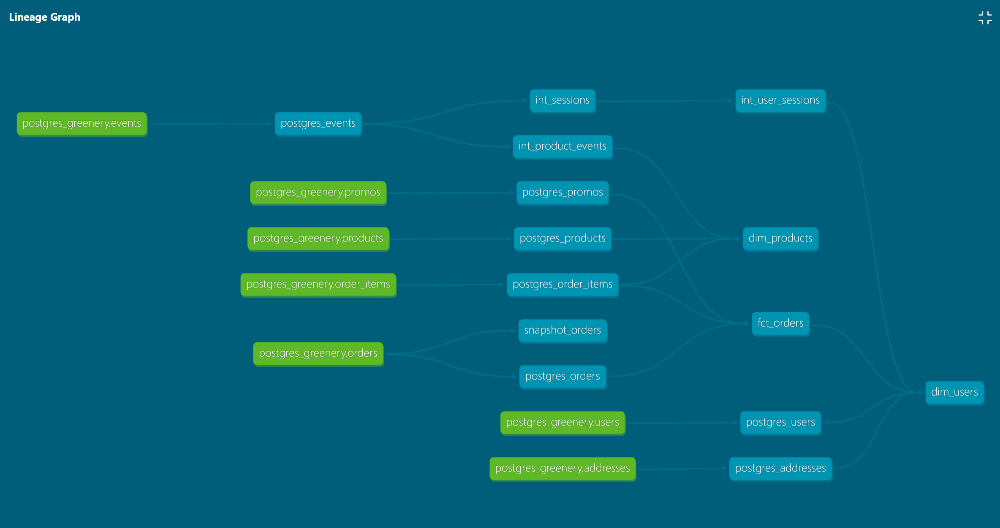

# Answers to Week 2 Project Questions

## Part 1. Models 
_What is our user repeat rate?_

79.8%
```sql
with repeats as (
select user_guid
    , case when count(distinct order_guid) > 1 then 'repeat'
    else 'no_repeat'
    end as repeat_status
from dev_db.dbt_simonc.postgres_orders
group by user_guid
)

, repeat_count as (
    select 
    sum(case when repeat_status = 'repeat' then 1 else 0 end) as repeats
    , sum(case when repeat_status = 'no_repeat' then 1 else 0 end) as no_repeats
    , count(user_guid) as total
from repeats
    )
    
select repeats/total as repeat_rate from repeat_count;
```

_What are good indicators of a user who will likely purchase again? What about indicators of users who are likely NOT to purchase again? If you had more data, what features would you want to look into to answer this question?_

I would tackle this question by looking at some of the following features, which might indicate likelihood to purchase again:
- Features of events, eg number of interactions with the website (high), types of interaction (include shopping cart), length of session (long) - the inverse of these will generally indicate a user unlikely to purchase again
- Features of the user's order, eg value (high), time to delivery (short), promotion usage (low) - the inverse of these will generally indicate a user unlikely to purchase again
- Features of user, eg location (and other user data if I had it)

_More stakeholders are coming to us for data, which is great! But we need to get some more models created before we can help. Create a marts folder, so we can organize our models, with the following subfolders for business units:_
    - Core
    - Marketing
    - Product

Done!

_Within each marts folder, create intermediate models and dimension/fact models._

New models created:
- Core
    - int_sessions
    - fct_orders
- Marketing
    - int_user_sessions
    - dim_users
- Product
    - int_product_events
    - dim_products

_Explain the marts models you added. Why did you organize the models in the way you did?_

I found organising the models and selecting which 'layer' they should live in surprisingly challenging - I reorganised my models several times before I was satisfied. This was partly due to dependencies (for example, the `dim_users` model in the marketing mart is dependent on the `fct_orders` model in core), but also partly due to overlapping usage. (For example, I struggled with whether `dim_users` belonged in the marketing mart or in core). Ultimately, I tried to think of use cases and target the dimensional and fact tables towards common use cases (marketing: retargeting, product: site and product analysis and optimisation).

_Use the dbt docs to visualize your model DAGs to ensure the model layers make sense_


The image above visualizes the complete DAG for the Greenery project.

## Part 2. Tests

_We added some more models and transformed some data! Now we need to make sure they’re accurately reflecting the data. Add dbt tests into your dbt project on your existing models from Week 1, and new models from the section above_

Done!

_What assumptions are you making about each model? (i.e. why are you adding each test?)_

- Assuming referential integrity (ie guids are relational across tables)
- Assuming prices are >=0 and various other common-sense rules are followed

_Did you find any “bad” data as you added and ran tests on your models? How did you go about either cleaning the data in the dbt model or adjusting your assumptions/tests?_
    _Apply these changes to your github repo_

- I had assumed that all users had placed orders, but this actually wasn't true, so I added some zeroifnull() operators to my user summary columns (eg lifetime units, lifetime sales) so I wouldn't end up with nulls in this column
- I noticed that `package_shipped` events caused sessions to look unnaturally long, so I had to clean the data in the sessions table by excluding these events from duration calculations

_Your stakeholders at Greenery want to understand the state of the data each day. Explain how you would ensure these tests are passing regularly and how you would alert stakeholders about bad data getting through._

I would set up a cron job (or use some other orchestration tool) to run `dbt test` every morning, and pipe the results to a Slack channel where the data team (and any interested business users) can monitor any test failures. If a test failed, I would then be able to share details and context directly in Slack.

## Part 3. dbt Snapshots 
_Let's update our orders snapshot that we created last week to see how our data is changing:_

1. _Run the orders snapshot model using dbt snapshot and query it in snowflake to see how the data has changed since last week._ (Done)
2. _Which orders changed from week 1 to week 2?_

The following orders changed status, from 'preparing' to 'shipped': 939767ac-357a-4bec-91f8-a7b25edd46c9, 05202733-0e17-4726-97c2-0520c024ab85, 914b8929-e04a-40f8-86ee-357f2be3a2a2