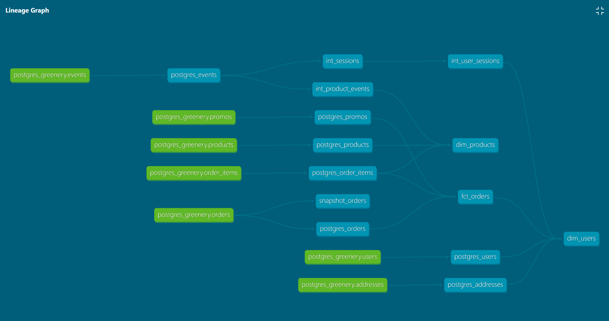

# Answers to Week 3 Project Questions

## Part 1: Models 

_What is our overall conversion rate?_

62.4%

```sql
with conversions as (
    select count(distinct session_guid) converting_sessions
from dev_db.dbt_simonc.int_events_unpacked
where event_type = 'checkout'
)

, all_sessions as (
    select count(distinct session_guid) all_sessions
    from dev_db.dbt_simonc.int_events_unpacked
)

select converting_sessions / all_sessions as cvr
from conversions
full outer join all_sessions;
```

_What is our conversion rate by product?_

| PRODUCT_GUID                         | SESSIONS | CHECKOUTS | CVR   |
|--------------------------------------|----------|-----------|-------|
| fb0e8be7-5ac4-4a76-a1fa-2cc4bf0b2d80 | 64       | 39        | 60.9% |
| 74aeb414-e3dd-4e8a-beef-0fa45225214d | 63       | 35        | 55.6% |
| 5b50b820-1d0a-4231-9422-75e7f6b0cecf | 59       | 28        | 47.5% |
| 55c6a062-5f4a-4a8b-a8e5-05ea5e6715a3 | 62       | 30        | 48.4% |
| 579f4cd0-1f45-49d2-af55-9ab2b72c3b35 | 54       | 28        | 51.9% |
| c17e63f7-0d28-4a95-8248-b01ea354840e | 55       | 30        | 54.5% |
| d3e228db-8ca5-42ad-bb0a-2148e876cc59 | 56       | 26        | 46.4% |
| 615695d3-8ffd-4850-bcf7-944cf6d3685b | 65       | 32        | 49.2% |
| 58b575f2-2192-4a53-9d21-df9a0c14fc25 | 61       | 24        | 39.3% |
| e2e78dfc-f25c-4fec-a002-8e280d61a2f2 | 63       | 26        | 41.3% |
| 5ceddd13-cf00-481f-9285-8340ab95d06d | 67       | 33        | 49.3% |
| e8b6528e-a830-4d03-a027-473b411c7f02 | 73       | 29        | 39.7% |
| 6f3a3072-a24d-4d11-9cef-25b0b5f8a4af | 51       | 21        | 41.2% |
| 689fb64e-a4a2-45c5-b9f2-480c2155624d | 67       | 36        | 53.7% |
| b86ae24b-6f59-47e8-8adc-b17d88cbd367 | 53       | 27        | 50.9% |
| 64d39754-03e4-4fa0-b1ea-5f4293315f67 | 59       | 28        | 47.5% |
| bb19d194-e1bd-4358-819e-cd1f1b401c0c | 78       | 33        | 42.3% |
| 843b6553-dc6a-4fc4-bceb-02cd39af0168 | 68       | 29        | 42.6% |
| 37e0062f-bd15-4c3e-b272-558a86d90598 | 62       | 29        | 46.8% |
| c7050c3b-a898-424d-8d98-ab0aaad7bef4 | 75       | 34        | 45.3% |
| e5ee99b6-519f-4218-8b41-62f48f59f700 | 66       | 27        | 40.9% |
| e706ab70-b396-4d30-a6b2-a1ccf3625b52 | 56       | 28        | 50.0% |
| be49171b-9f72-4fc9-bf7a-9a52e259836b | 49       | 25        | 51.0% |
| e18f33a6-b89a-4fbc-82ad-ccba5bb261cc | 70       | 28        | 40.0% |
| 35550082-a52d-4301-8f06-05b30f6f3616 | 45       | 22        | 48.9% |
| b66a7143-c18a-43bb-b5dc-06bb5d1d3160 | 63       | 34        | 54.0% |
| a88a23ef-679c-4743-b151-dc7722040d8c | 46       | 22        | 47.8% |
| 80eda933-749d-4fc6-91d5-613d29eb126f | 74       | 31        | 41.9% |
| 4cda01b9-62e2-46c5-830f-b7f262a58fb1 | 61       | 21        | 34.4% |
| 05df0866-1a66-41d8-9ed7-e2bbcddd6a3d | 60       | 27        | 45.0% |

```sql
select product_guid, sessions, checkouts, checkouts / sessions as cvr
from dev_db.dbt_simonc.int_product_events;
```

_A question to think about: Why might certain products be converting at higher/lower rates than others?_
We could look at a few angles to determine this: cost, shipping fees, type of product, product page quality, etc.

## Part 2: Macros

_Create a macro to simplify part of a model(s). Think about what would improve the usability or modularity of your code by applying a macro. Large case statements, or blocks of SQL that are often repeated make great candidates. Document the macro(s) using a .yml file in the macros directory._

I created a macro called 'agg_event_type' as a reusable function to aggregate session information by event type.

## Part 3: Hooks

_Add a post hook to your project to apply grants to the role “reporting”._

Done!

## Part 4: Packages

_Install a package (i.e. dbt-utils, dbt-expectations) and apply one or more of the macros to your project_

I installed dbt_utils and used the `expression_is_true` test to define a `>= 0` test for numeric columns in my models. 

_Show (using dbt docs and the model DAGs) how you have simplified or improved a DAG using macros and/or dbt packages._

I used dbt_utils' `surrogate_key` macro to generate a surrogate key for my new `int_events_unpacked` table, which unpacks `checkout` and `package_shipped` events (normally linked to an `order_guid`) into an event for each product in that order. For example, an order which included three products would look like this in the original product table (alongside a pageview for one of the products):

| EVENT_GUID | PRODUCT_GUID | ORDER_GUID |
|------------|--------------|------------|
| 12         | NULL         | 23         |
| 13         | 6            | NULL       |

and in the unpacked table would look like this:

| SURROGATE_KEY | EVENT_GUID | PRODUCT_GUID | ORDER_GUID |
|---------------|------------|--------------|------------|
| 67            | 12         | 6            | 23         |
| 78            | 12         | 7            | 23         |
| 89            | 12         | 8            | 23         |
| 90            | 13         | 6            | NULL       |

This allowed me to create a table which included all product-related events, expanding the `int_product_events` table from just a summary of pageviews and adds to cart (not particularly useful on its own) to a summary of all events related to that product.

You can see the difference between the two lineage graphs below (although admittedly the week 3 graph looks messier - I probably need to add some more intermediate models for `postgres_users` and `postgres_addresses`):


_Week 2_


_Week 3_

## Part 5: Macros

_Which orders changed from week 2 to week 3?_

5741e351-3124-4de7-9dff-01a448e7dfd4, e24985f3-2fb3-456e-a1aa-aaf88f490d70, 8385cfcd-2b3f-443a-a676-9756f7eb5404

These orders changed status from 'preparing' to 'shipped'.